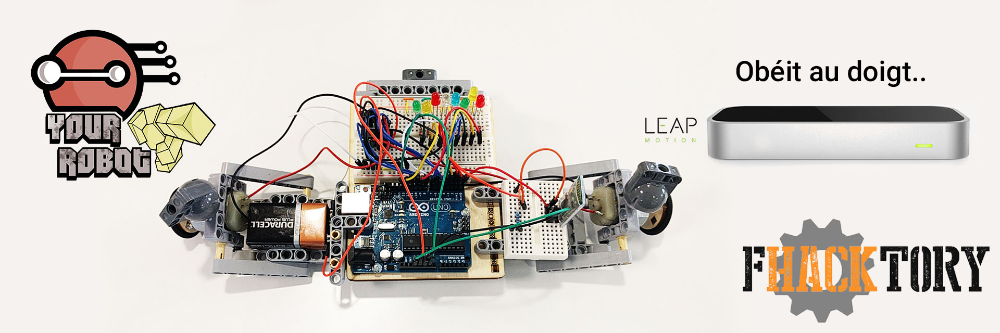

<h2>Table des matières</h2>

<ul>
<li><a href="#sec-1">1. Your-Robot</a></li>
<li><a href="#sec-2">2. Prérequis</a></li>
<li><a href="#sec-3">3. Circuit</a></li>
<li><a href="#sec-4">4. How it works ?</a></li>
<li><a href="#sec-5">5. Troubleshooting</a></li>
</ul>

# Your-Robot

Robot piloté par un Leap Motion et pilotable aussi à l'aide d'un module Bluetooth
à travers une application Android (Ardudroid) installée sur votre smartphone.

# Prérequis

-   Arduino Uno
-   Leap Motion
-   Module Bluetooth HC-06
-   2 moteurs DC
-   8 diodes LED
-   Circuit intégré L298 ou L293

# Circuit

# How it works ?

-   Télécharger et installer [Processing](https://processing.org/download/) et [Arduino IDE](https://www.arduino.cc/en/Main/Software).
-   Ouvrer dans [Arduino IDE](https://www.arduino.cc/en/Main/Software) le code se trouvant dans le dossier Arduino.
    -   Connecter l'Arduino à votre ordinateur et téléverser le code.
-   Ouvrer dans [Processing](https://processing.org/download/) le code se trouvant dans le dossier Processing.
    -   Brancher le Leap Motion
    -   Exécuter le code.

# Troubleshooting

-   Sous Linux, vous aurez peut-être un problème du type :
    
        Arduino IDE error - avrdude: ser_open(): can't open device "/dev/ttyACM0": Permission denied
    
    -   Pour régler ce problème, entrer cette commande: 
        
            sudo chmod a+rw /dev/ttyACM0

<h2 class="footnotes">Notes de bas de page: </h2>

<a id="fn.1" name="fn.1" class="footnum" href="#fnr.1">1</a> Sous Linux il faut lancer la commande #+BEGINSRC sh
sudo leapd
\\#+ENDSRC pour faire fonctionner le Leap Motion.

